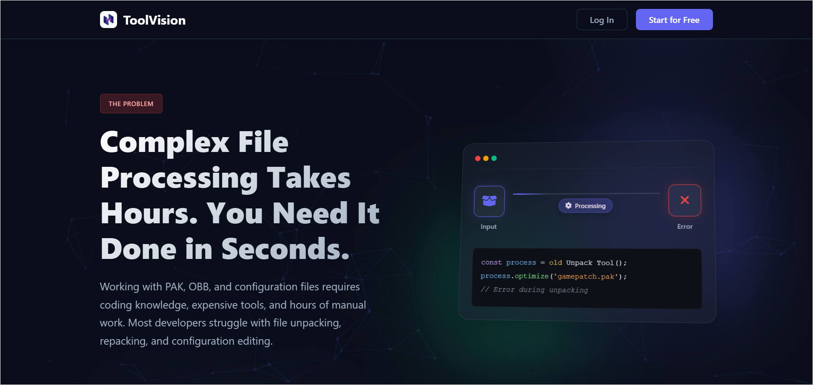
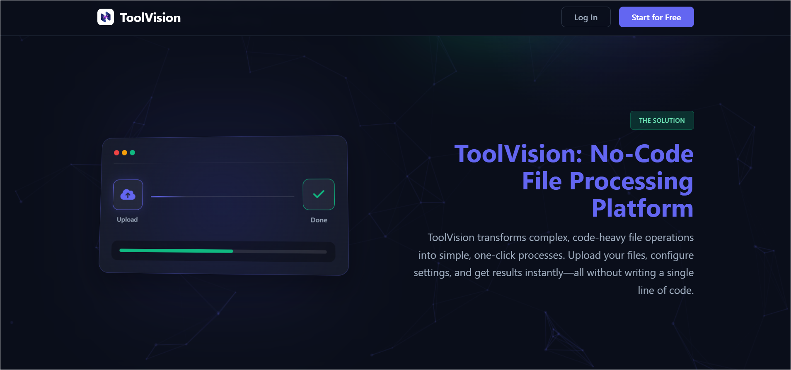
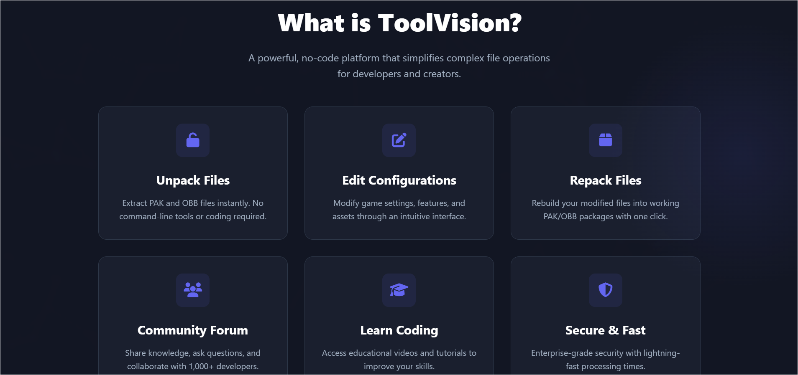
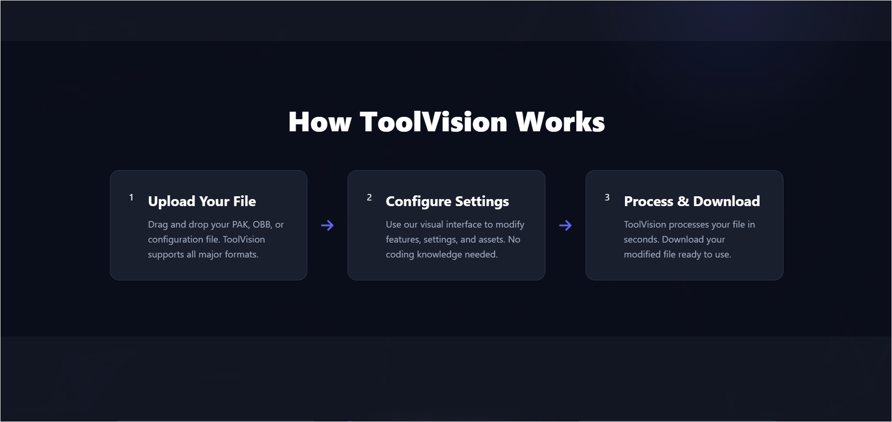
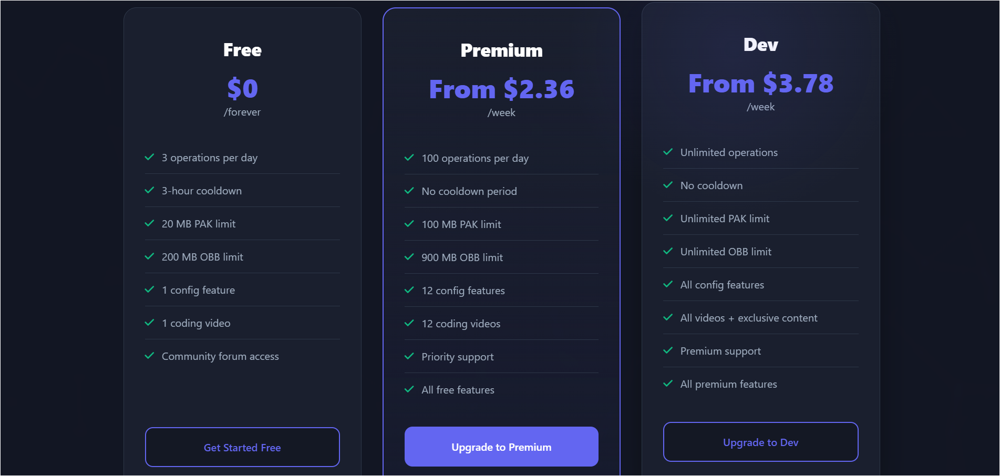

  
   
  

    <b>The Professional No-Code Platform for Game File Processing & Modification</b>
  

---

  
    
  
    
  
    
  
    
  

---

📞 Contact Us

For questions or support, you can reach out to us.

---

Made with ❤️ by the ToolVision Team

